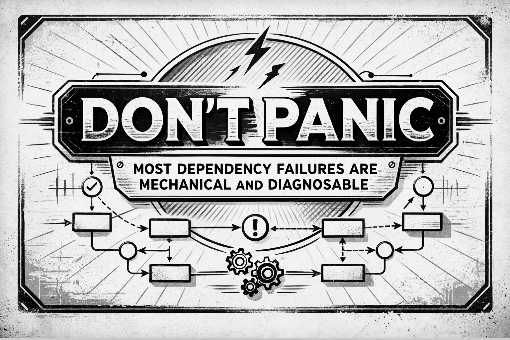

# Welcome to the Sample of the Dependency Management Troubleshooting Guide

{height=100px}

This QR code takes you to the HeroDevs website where you get the latest version of this sample and register for the complete book when available.

{width=80%}

# Who This Book Is For {.unnumbered}

Dependency management often behaves as you would guess enough times to earn your trust. Until it doesn’t. 

Most trouble stems not from misunderstanding Maven or Gradle syntax, but from making assumptions that conflict with how build tools actually operate. This book is about the mechanical rules that govern those operations.

### Who This Book Is For

If you have stared at a dependency tree and thought, “that doesn’t make sense,” this book is for you.

It is written for

- **Experienced Developers:** You know how to use exclusions and BOMs, but have learned that today’s fix can become tomorrow’s mystery.
- **Tech Leads & Build Owners:** You are responsible for build stability and must explain why a version changed or why "just upgrade it" isn't a strategy.
- **Platform & Security Engineers:** You recognize these failure modes as consequences of real-world dependency resolution, not just developer mistakes.
- **Junior Developers:** This guide will help you avoid persistent misconceptions early in your career.

### How to Use This Guide

This guide is designed for reactive use. When a version changes unexpectedly or a class disappears at runtime, scan the scenario titles. Each scenario provides rapid orientation: expected intuition, actual results, the underlying mechanism, and safe resolutions.

Alternatively, read several scenarios to understand the system's shape. You will notice recurring patterns—these represent the core mechanics of dependency resolution.

### What This Book Is Not

This is not a reference manual or a replacement for official documentation. It does not provide exhaustive command sequences. 

Instead, it explains the "why." Dependency resolution is not intuitive or opinionated; it is mechanical, structural, and remarkably consistent. Once you understand the rules, the behavior becomes predictable.
